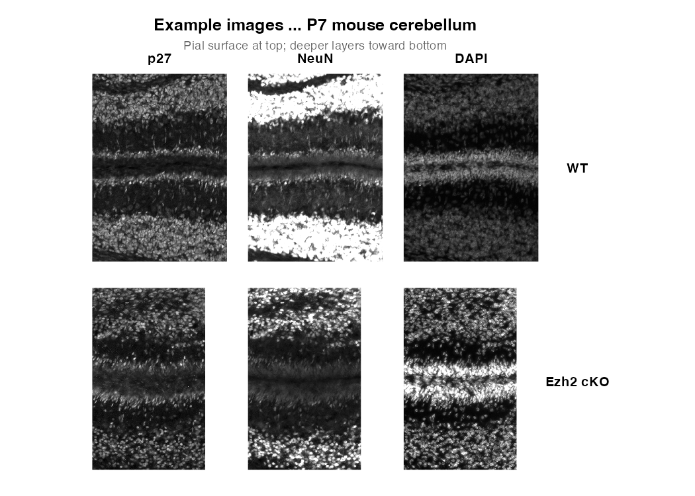
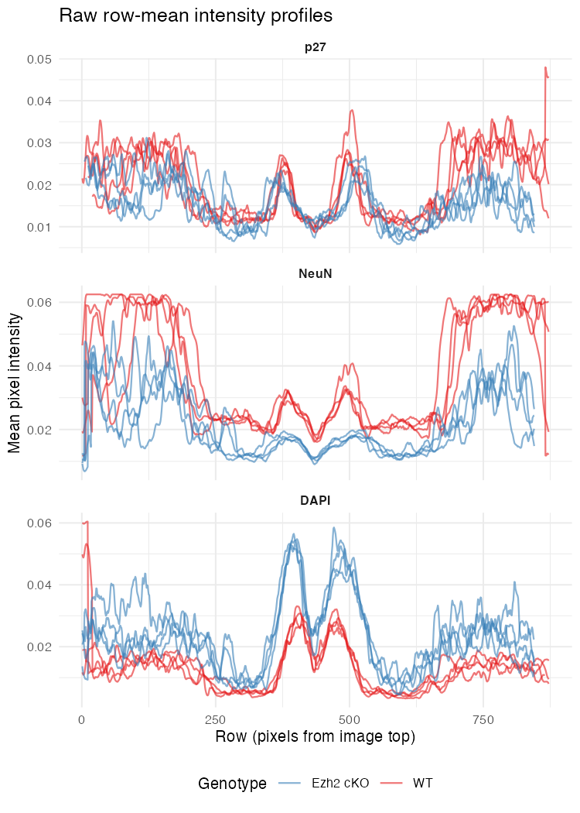
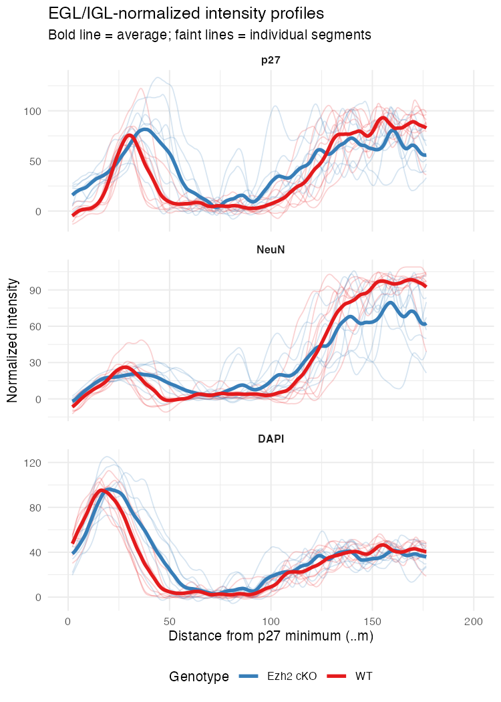
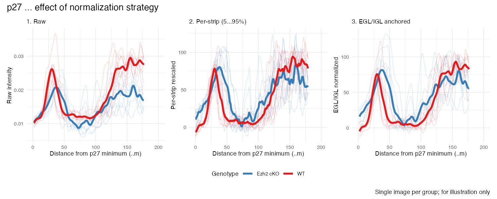
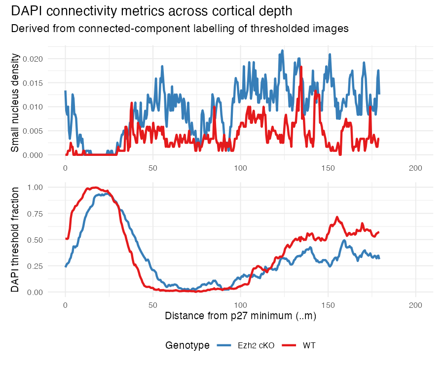

# layer_quant

Quantification of immunofluorescence signal intensity across cerebellar cortical layers from multi-channel TIFF images.

## Overview

This pipeline measures how fluorescent markers are distributed across the cerebellar cortex depth. Starting from raw microscopy images, it:

1. Computes row-wise intensity statistics across column segments of each image
2. Aligns multiple image strips to a common reference using cross-correlation
3. Normalizes intensity profiles to anatomical landmarks (EGL, ML, IGL)
4. Identifies and corrects for the pial boundary position
5. Produces publication-quality plots comparing groups (e.g. genotypes)

The approach is designed for P7 mouse cerebellum imaged with antibodies against nuclear markers (p27, NeuN) and DAPI, but is generalizable to any multi-channel fluorescence images where you want a depth profile across a tissue layer.

## Pipeline diagram

```
Raw .tif images (multi-frame)
        |
        v
align_folia_images_connect()
  - load_image_and_compute_rowmeans_conn2()   per-image row stats + connectivity
  - compute_shift_and_correlation()           CCF-based pairwise alignment
  - align_data()                              apply shifts
        |
        v
Quality filter (MaxCorrelation > 0.5)
Row coverage filter (>= 80% of images cover each row position)
        |
        v
Shift data to common origin (p27 local minimum = row 0)
Scale pixel coordinates to microns
        |
        v
egl_igl_normalize()        anchor normalization to EGL and IGL
        |
        v
egl_remove_high()          remove tracks with no IGL signal
        |
        v
pia_prunner()              detect pial boundary, re-align to pial surface
        |
        v
plot_layer_boundary2()     line profiles + difference plot + violin + stats
```

## Image and data format

Each `.tif` file should be a multi-frame TIFF where each frame is one immunofluorescence channel (e.g. frame 1 = DAPI, frame 2 = p27, frame 3 = NeuN). Images should be oriented so that the pial surface is at the top (low row index) and deeper layers are toward the bottom (high row index).

The function `align_folia_images_connect()` expects images to be pre-cropped into strips oriented perpendicular to the cortical layers — i.e. each image column runs from pial surface to white matter.

## Functions

### `align_folia_images_connect.R`

**`align_folia_images_connect(directory_path, frame_names, reference_frame, pixel_segment_length)`**

Main entry point. Loads all `.tif` files from a directory, computes row statistics per column segment, finds the image with the highest average cross-correlation to all others, and aligns everything to that reference.

Returns a long-format data frame with one row per `(image segment × channel × row position)`:

| Column | Description |
|--------|-------------|
| `Row` | Row position within the image (pixels) |
| `Frame` | Channel name (e.g. "DAPI", "p27", "NeuN") |
| `filename` | Source image + segment identifier |
| `RowMean` | Mean pixel intensity across the segment width |
| `Variance`, `SD` | Variance and SD of pixel intensity |
| `thr_mean` | Mean of Otsu-thresholded image (fraction of pixels above threshold) |
| `conn_background` | Fraction of pixels classified as background (no nucleus) |
| `conn_small` | Fraction of pixels in small connected components (< 100 px) |
| `conn_large` | Fraction of pixels in large connected components (>= 100 px) |
| `conn_small_num` | Density of small connected components (proxy for cell count) |
| `MaxCorrelation` | Maximum cross-correlation to the reference image |

**`pixel_segment_length`**: images are divided into column segments of this width (pixels) before computing row statistics. Using multiple segments per image gives replicate measurements and helps average over local variation in tissue depth.

---

### `classify_connectivity_segments.R`

**`classify_connectivity_segments(input, pixel_cutoff, small_imout, thres_imout)`**

Takes a thresholded EBImage object (or a filename) and labels connected components. Classifies each component as:
- `0` — background
- `1` — large nucleus (>= `pixel_cutoff` pixels, default 100)
- `2` — small connected component (< `pixel_cutoff` pixels)

Used internally by `align_folia_images_connect()` to compute connectivity-based metrics on each image strip.

---

### `elg_igl_normalize.R`

**`egl_igl_normalize(data, igl_min_x, igl_max_x, ml_min_x, ml_max_x, DAPI_max_site, smooth)`**

Normalizes intensity profiles using anatomical reference regions rather than per-image percentiles. The default reference points are:

- **Low anchor (minimum):** molecular layer (ML), rows 120–160 from the pial surface
- **High anchor (maximum):** inner granule layer (IGL), rows 250–350

This ensures that the same tissue structures produce the same normalized values across animals and imaging sessions.

`DAPI_max_site` controls whether DAPI is normalized to the IGL (`"igl"`, the default for P7 where the IGL is dense) or the EGL (`"egl"`, for developmental stages where the EGL is the dominant nuclear layer).

Adds a `RescaledIntensityInRange` column to the data.

---

### `pia_prunner.R`

**`pia_prunner(data, pia_detect_xlimit, min_peak_height, p27_pixel_cutoff, DAPI_pixel_cutoff)`**

Detects the pial surface boundary in each image strip. The pia mater sits just outside the EGL and has very low p27 and NeuN signal but elevated DAPI. The function identifies the boundary as the point where p27 and NeuN signal drops off abruptly when moving outward from the EGL.

Algorithm:
1. Smooth intensity profiles with a rolling mean (k=5)
2. Compute point-wise derivative of smoothed p27 and NeuN
3. Multiply the derivatives to find positions where both drop simultaneously
4. Use `pracma::findpeaks()` to locate the sharpest combined drop
5. Filter out false positives: reject peaks that are closer to the p27 or DAPI EGL peak than `p27_pixel_cutoff` / `DAPI_pixel_cutoff`

Returns a data frame with one row per `(filename, xpslit)` containing `peak_position` — the pixel offset to subtract from `Row_shift_scale` to align the pial surface to position 0.

---

### `plot_layer_boundary2.R`

**`plot_layer_boundary2(data, sel_frame, x_col_name, y_col_name, comparison_order, biological_rep, metadata, stat, ...)`**

Generates a three-panel combined figure:

1. **Line profiles** — individual image strips (faint) with group averages overlaid, faceted by comparison group. Dashed vertical lines mark the positions of maximum and minimum group difference.
2. **Difference plot** — average intensity of group 2 minus group 1 across position. X-axis is on top to align with the line plot above.
3. **Violin plots** — distribution of intensities at the two marked positions (max and minimum difference), with biological replicate averages overlaid as jittered points and a significance annotation.

Statistics use either `t.test` (default, on biological replicate means) or `lmer` (linear mixed model with biological replicate as random effect, requires `lmerTest`).

---

### `egl_remove_high.R`

Removes image strips where the smoothed p27 intensity in the first 150 pixels exceeds a threshold. These tracks lack IGL signal and would produce incorrect normalization.

---

### `plot_mcp_segments2.R`

**`plot_mcp_segments2(filename_example, sign, channel, means_all, data)`**

Diagnostic plot for multi-changepoint (MCP) model fits. Draws the fitted piecewise-linear segments on top of the raw intensity profile for a single image strip. Used to inspect the quality of changepoint-based layer boundary detection.

## Example output

Generated from two real P7 mouse cerebellar sections included in `example_data/`
(one WT, one Ezh2 cKO; both 20× images, pixel width 0.512 µm). See
[`generate_example_figures.R`](generate_example_figures.R) for the code that
produced these.

### Raw images — p27, NeuN, DAPI (pial surface at top)


### Raw row-mean intensity profiles
Profiles before alignment or normalisation. The two images are not yet shifted
to a common origin.



### EGL/IGL-normalised profiles after alignment
After shifting both images to the p27 local minimum and normalising intensity
using the EGL (high) and molecular layer (low) as anatomical anchors.



### Effect of normalisation strategy on p27
Comparison of raw, per-strip (5–95th percentile), and EGL/IGL-anchored
normalisation for the p27 channel.



### DAPI connectivity metrics
Row-wise density of small connected components (proxy for nucleus count) and
fraction of pixels above the Otsu threshold, derived from connected-component
labelling.



---

## Usage example

See [`example_analysis.Rmd`](example_analysis.Rmd) for a complete worked example using the included images.

Quick start with your own data:

```r
library(dplyr)
library(ggplot2)
library(patchwork)

source("align_folia_images_connect.R")
source("classify_connectivity_segments.R")
source("elg_igl_normalize.R")
source("pia_prunner.R")
source("plot_layer_boundary2.R")

# 1. Load and align images
aligned_data <- align_folia_images_connect(
  "path/to/your/tif/directory/",
  frame_names = c("DAPI", "p27", "NeuN"),
  pixel_segment_length = 200
)

# 2. Attach genotype metadata (your own mapping)
genotyping <- data.frame(
  filename = unique(aligned_data$filename),
  genotype = c("WT", "KO", ...)   # fill in your genotypes
)
aligned_data <- left_join(aligned_data, genotyping, by = "filename")

# 3. Filter, normalize, trim pia
filtered  <- aligned_data |> filter(MaxCorrelation > 0.5)
normalized <- egl_igl_normalize(filtered, DAPI_max_site = "igl")
pia_peaks  <- pia_prunner(normalized)

pia_aligned <- normalized |>
  left_join(pia_peaks, by = c("filename", "xpslit")) |>
  mutate(AlignedRow = Row_shift_scale - peak_position)

# 4. Plot
plot_layer_boundary2(
  pia_aligned,
  sel_frame        = "p27",
  x_col_name       = "AlignedRow",
  y_col_name       = "RescaledIntensityInRange",
  comparison_order = c("WT", "KO"),
  biological_rep   = "Mouse",
  metadata         = your_metadata_df
)
```

## Dependencies

```r
install.packages(c(
  "dplyr", "tidyr", "ggplot2", "patchwork",
  "stringr", "zoo", "pracma",
  "RColorBrewer", "ggrepel", "ggsignif",
  "lme4", "lmerTest"
))

if (!requireNamespace("BiocManager", quietly = TRUE))
  install.packages("BiocManager")
BiocManager::install("EBImage")
```

## File structure

```
layer_quant/
├── README.md
├── example_analysis.Rmd          # worked example with simulated data
├── align_folia_images_connect.R  # image loading, row stats, CCF alignment
├── classify_connectivity_segments.R  # connected component classification
├── elg_igl_normalize.R           # EGL/IGL anchor normalization
├── pia_prunner.R                  # pial boundary detection
├── egl_remove_high.R             # remove strips lacking IGL
├── plot_layer_boundary2.R        # combined publication figure
├── plot_layer_boundary.R         # earlier version of plotting function
├── plot_mcp_segments2.R          # MCP diagnostic plots
├── fit_mcp_model.R               # multi-changepoint model fitting
└── fit_mcp_model2.R              # updated MCP fitting
```
